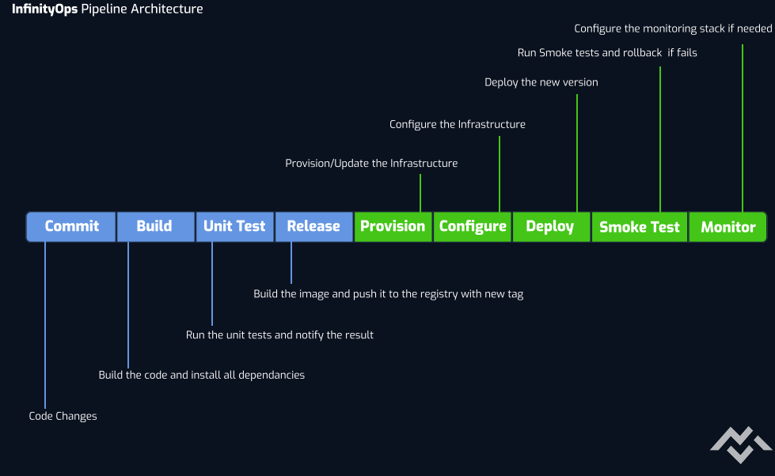

<h1 align="center"> Welcome to My Playground! </h1>

  

<h2 align="center"> About Me </h2>

I am a dedicated <b> DevOps Engineer </b> with a strong focus on automating and optimizing infrastructure to enhance the development and deployment processes. I aim to bridge the gap between development and operations by implementing best practices and utilizing modern tools to deliver efficient, scalable, and secure solutions.

<h2 align="center"> Skills </h2>

 <b> Programming </b> 

 Python | Bash | C# | SQL | Django 

 <b> CI / CD </b> 

 Jenkins | ArgoCD | Github Actions 

 <b> Containerization & Orchestration </b> 

 Kubernetes | Docker | Containerd | Helm 

 <b> Infrastructure as Code (IaC) </b> 

 Terraform | Ansible | CloudFormation 

 <b> Cloud Providers </b> 

 aws | GCP | VPSie 

 <b> Databases </b> 

 MySQL | XtraDB | MongoDB 

 <b> Monitoring & Logging </b> 

 Prometheus | Grafana | Loki 

<h2 align="center"> Projects </h2>

<h3 align="center"> InfinityOps: end-to-end DevOps Project </h3>

<!--  -->

- **Description:** Designed a Jenkins pipeline that automatically
deploys Dockerized microservices to a K8s cluster.

- **Technologies Used:** Docker, Kubernetes, Jenkins, Terraform, AWS
- **Key Achievements:**
  - Successfully implemented CI/CD pipelines to automate testing and deployment processes.
  - Managed Kubernetes clusters to enhance application scalability and reliability.

<h3 align="center"> PromStack
 </h3>

- **Description:** Designed and deployed a comprehensive monitoring solution using the Prometheus Stack and Loki Stack. Automated the installation and configuration of monitoring agents across multiple servers using Ansible, ensuring consistency and efficiency in deployment.
  
- **Technologies Used:** Ansible, Prometheus, Loki, Grafana
- **Key Achievements:**
  - Developed an Ansible playbook to fully automate agent installation, reducing manual configuration time by 80%.
  - Implemented advanced alerting mechanisms in Prometheus to detect system anomalies, ensuring proactive incident response.
  - Optimized Loki and Prometheus configurations for high availability, improving system reliability and reducing downtime.
  - Customized Grafana dashboards to provide actionable insights for infrastructure and application performance monitoring.

<!-- <h2 align="center"> Certifications </h2>

<h4 align="center"> <a> Advanced Cloud DevOps </a></h4> -->

<h2 align="center"> Contact </h2>

 I welcome opportunities for collaboration, discussions, or inquiries. Please feel free to reach out 

- **Email:** amattar21@proton.me
- **LinkedIn:** [Ahmed Mattar](http://www.linkedin.com/in/m4tt4r)
